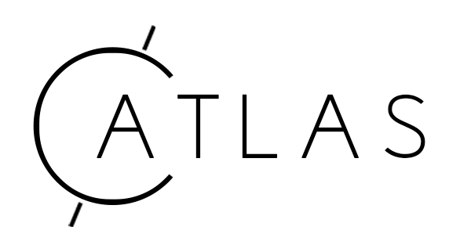

# Atlas




[](https://goreportcard.com/report/github.com/cosmos/atlas)
[](https://codecov.io/gh/cosmos/atlas)
[](https://pkg.go.dev/github.com/cosmos/atlas)

> Source code for the default [Cosmos SDK](https://github.com/cosmos/cosmos-sdk) module
registry, viewable online at [atlas.cosmos.network](https://atlas.cosmos.network).

## Table of Contents

- [Atlas](#atlas)
  - [Table of Contents](#table-of-contents)
  - [Background](#background)
  - [Usage](#usage)
    - [Server](#server)
    - [Web App](#web-app)
  - [Migrations](#migrations)
  - [Tests](#tests)
  - [License](#license)

## Background

Atlas implements a [Cosmos SDK](https://github.com/cosmos/cosmos-sdk) module registry,
where developers are able to publish and update modules. The registry provides a singular and
holistic interface for application developers to discover [Cosmos SDK](https://github.com/cosmos/cosmos-sdk)
modules when building their blockchain applications.

More information about the architecture, publishing and module configuration can
be found under [docs](./docs/README.md).

## Usage

Atlas is composed of two primary components, the server and the web application.
The server is responsible for providing a RESTful API, handling user authentication
via Github OAuth and persisting modules and relevant data to PostgreSQL.

### Server

In order to start the Atlas server, you must provide a series of configuration
values that may be defined in environment variables, a (TOML) configuration file
or via CLI flags (in order of precedence). See the sample [env](./.env.sample) or
[config](./config.sample.toml) files for all possible configurations.

```shel
$ atlas server --config=/path/to/atlas/config.toml
```

Note:

1. Atlas will look for environment variables defined in a `.env` file in the
root directory. Any explicit environment variables defined will override those
defined in this file.
2. Certain configuration values are not exposed or able to be provided via CLI flags.
3. All environment variables must be prefixed with `ATLAS_*`.

See `--help` for further documentation.

### API Documentation

Atlas leverages [Swagger](https://swagger.io/) to document its API. The documentation
is compiled automatically via [swag](https://github.com/swaggo/swag/) through
annotated REST handlers. The compiled documentation resides in the `docs/api`
directory and is served at `/api/docs/`.

The [Swagger](https://swagger.io/) documentation can be recompiled as follows:

```shell
$ make update-swagger-docs
```

### Web App

TODO

## Migrations

Atlas performs migrations through the [migrate](https://github.com/golang-migrate/migrate)
tool. The migrations are defined in `db/migrations`. In order to run migrations,
you must provide a `ATLAS_DATABASE_URL` environment variable.

```shell
$ ATLAS_DATABASE_URL=... make migrate
```

## Tests

Atlas performs all database relevant tests through a Docker Postgres instance.
Executing the `$ make test` target will automatically start a Postgres Docker
instance and populate all relevant environment variables. If you'd like to execute
tests on a different Postgres instance, you must provide the `ATLAS_MIGRATIONS_DIR`
and `ATLAS_TEST_DATABASE_URL` environment variables.

```shell
$ ATLAS_TEST_DATABASE_URL=... ATLAS_MIGRATIONS_DIR=... make test
```

## License

- [Apache License, Version 2.0](https://www.apache.org/licenses/LICENSE-2.0)
